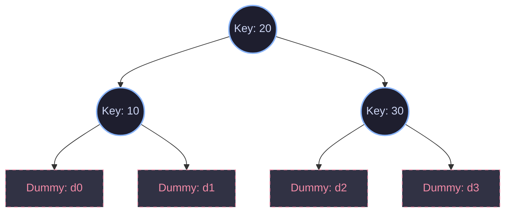

# Department of Computer Science & Engineering
## Design and Analysis of Algorithms (24CS01TH0201)

<div align="center">
  <h3>🎓 Academic Practical Submission</h3>
  <hr />
  <table style="width:100%; border:none;">
    <tr>
      <td><strong>Student Name:</strong> Advait Kawale</td>
      <td><strong>Roll No:</strong> 42</td>
    </tr>
    <tr>
      <td><strong>Section:</strong> A4 (B3)</td>
      <td><strong>Semester:</strong> 2nd Year, 3rd Semester</td>
    </tr>
    <tr>
      <td><strong>Course:</strong> Design & Analysis of Algorithms</td>
      <td><strong>Course Code:</strong> 24CS01TH0201</td>
    </tr>
  </table>
  <hr />
</div>

---

# 📚 Practical 6: Construction of Optimal Binary Search Tree (OBST)

## 🎯 Aim
To implement and analyze the construction of an **Optimal Binary Search Tree (OBST)** using **Dynamic Programming** to minimize search costs for both successful and unsuccessful key lookups.

---

## 💡 Theoretical Overview

A **Binary Search Tree (BST)** is a binary tree where each node has a key, and for any node, all keys in its left subtree are smaller, and all keys in its right subtree are larger. When we frequently search for keys in a BST, the arrangement of nodes heavily influences the search performance.

An **Optimal Binary Search Tree (OBST)** is a BST constructed in such a way that the average or expected search time is minimized, given the search probabilities (or frequencies) of both:
1. **Successful Searches ($P_i$):** The probability of searching for keys that are actually present in the tree.
2. **Unsuccessful Searches ($Q_i$):** The probability of searching for values that lie in the intervals between the keys (dummy keys representing ranges of absent data).



### 🧠 Dynamic Programming Substructure

The problem of constructing an OBST exhibits **optimal substructure**. If an optimal tree $T$ has a root $k_r$, then the left subtree $T_L$ must be an optimal BST for the keys $k_i, \dots, k_{r-1}$ and dummy keys $d_{i-1}, \dots, d_{r-1}$, and the right subtree $T_R$ must be an optimal BST for the keys $k_{r+1}, \dots, k_j$ and dummy keys $d_r, \dots, d_j$.

#### Recurrence Relations

Let $e[i, j]$ be the expected cost of searching an optimal BST containing keys $k_i, \dots, k_j$.
- **Base Case:** 
  When $j = i-1$, we only have the dummy key $d_{i-1}$.
  $$e[i, i-1] = q_{i-1}$$
- **Recursive Step:**
  For $1 \le i \le j \le n$, we choose a root $k_r$ (where $i \le r \le j$) that minimizes the sum of the expected search costs of the subtrees plus the sum of all probabilities in the subproblem.
  $$e[i, j] = \min_{i \le r \le j} \left\{ e[i, r-1] + e[r+1, j] \right\} + w(i, j)$$
  
  Where $w(i, j)$ is the sum of probabilities of keys and dummy keys in the subproblem:
  $$w(i, j) = \sum_{l=i}^{j} p_l + \sum_{l=i-1}^{j} q_l$$
  We can compute $w(i, j)$ efficiently using:
  $$w(i, j) = w(i, j-1) + p_j + q_j$$

---

## 🛠️ Practical Tasks

The practical is divided into two distinct implementation tasks matching different application scenarios.

### 📖 Task 1: University Digital Library System
* **Scenario:** A digital library manages frequently accessed book IDs. Since lookups can be successful (finding an existing book ID) or unsuccessful (searching for a book ID that doesn't exist, falling between two existing sorted IDs), the objective is to find the minimum expected search cost using the standard successful search probability array $p$ and unsuccessful search probability array $q$.
* **Input Parameters:**
  - $n = 4$ (Number of keys)
  - Keys: $\{10, 20, 30, 40\}$
  - Successful probabilities $p = \{0.1, 0.2, 0.4, 0.3\}$
  - Unsuccessful probabilities $q = \{0.05, 0.1, 0.05, 0.05, 0.1\}$
* **Result:** Minimized expected search cost computed via bottom-up dynamic programming.

### 🎯 Task 2: Frequency-Based BST Optimization (GFG Variant)
* **Scenario:** A standard competitive programming problem where a sorted array of search keys and their corresponding frequency counts (number of searches) are given. There are no unsuccessful search dummy keys. The level of a node is defined as its depth plus one (Root level is 1). The target is to arrange keys into a BST to minimize the total search cost:
  $$\text{Total Cost} = \sum_{i=1}^{n} (\text{Level of } k_i) \times \text{Frequency}(k_i)$$
* **Dynamic Programming Formula:**
  $$dp[i][j] = \min_{i \le r \le j} \left\{ dp[i][r-1] + dp[r+1][j] \right\} + \sum_{l=i}^{j} \text{freq}[l]$$
* **Optimization:** Frequency sums are computed in $O(1)$ time using a **Prefix Sum Array** to optimize the lookup step.

---

## 📊 Complexity Analysis

### 1. Time Complexity
* **Matrix Traversal:** There are three nested loops:
  1. The outer loop controls the subproblem length $l$ from $1$ to $n$.
  2. The middle loop sets the starting index $i$ of the subproblem.
  3. The inner loop searches for the optimal root $r$ between $i$ and $j$.
* **Total Time Complexity:** $\mathcal{O}(n^3)$
  *(Note: This can be optimized to $\mathcal{O}(n^2)$ using Knuth's Optimization by restricting the root search range).*

### 2. Space Complexity
* **Storage Matrices:** Two 2D arrays $e[1 \dots n+1, 0 \dots n]$ and $w[1 \dots n+1, 0 \dots n]$ are used to store the intermediate expected search costs and prefix weights.
* **Total Space Complexity:** $\mathcal{O}(n^2)$

---

## 🗂️ File Directory Structure

The workspace consists of the following implementation files:
```bash
OBST-main/
│
├── OBST.c               # Dynamic programming solution for Task 1 (C language)
├── GFG_OBST.java        # Optimal search tree algorithm for Task 2 (Java language)
├── README.md            # Comprehensive documentation of DAA Practical 6
└── A4_B3_42_DAA_Practical_6.pdf # Official practical sheet & guidelines
```

---

## 🚀 Execution & Verification

### Compiling and Running Task 1 (C Program)
Ensure you have a C compiler (like `gcc`) installed. Execute the following commands in your terminal:

```bash
# Compile the C source file
gcc OBST.c -o OBST

# Run the compiled binary
./OBST
```

### Compiling Task 2 (Java Solution)
Ensure you have the Java Development Kit (JDK) installed. Execute the following:

```bash
# Compile the Java file
javac GFG_OBST.java
```

---

## 📈 Key Insights & Learning Outcomes
1. **Dynamic Programming vs. Greedy:** A greedy approach (e.g., choosing the highest frequency element as the root) does not always yield the globally optimal BST. Calculating overlapping subproblems bottom-up guarantees a globally optimal layout.
2. **Subproblem Interdependency:** The cost of subtrees depends not only on their own structure but also on the absolute depth adjustment when merged under a parent root node, which is cleanly compensated by adding the sum of frequencies $w(i,j)$ exactly once per merge level.
3. **Real-world Application:** OBST calculations are widely used in search engines, database indexing, router routing tables, and compiler symbol tables where key access patterns are highly skewed and highly predictable.